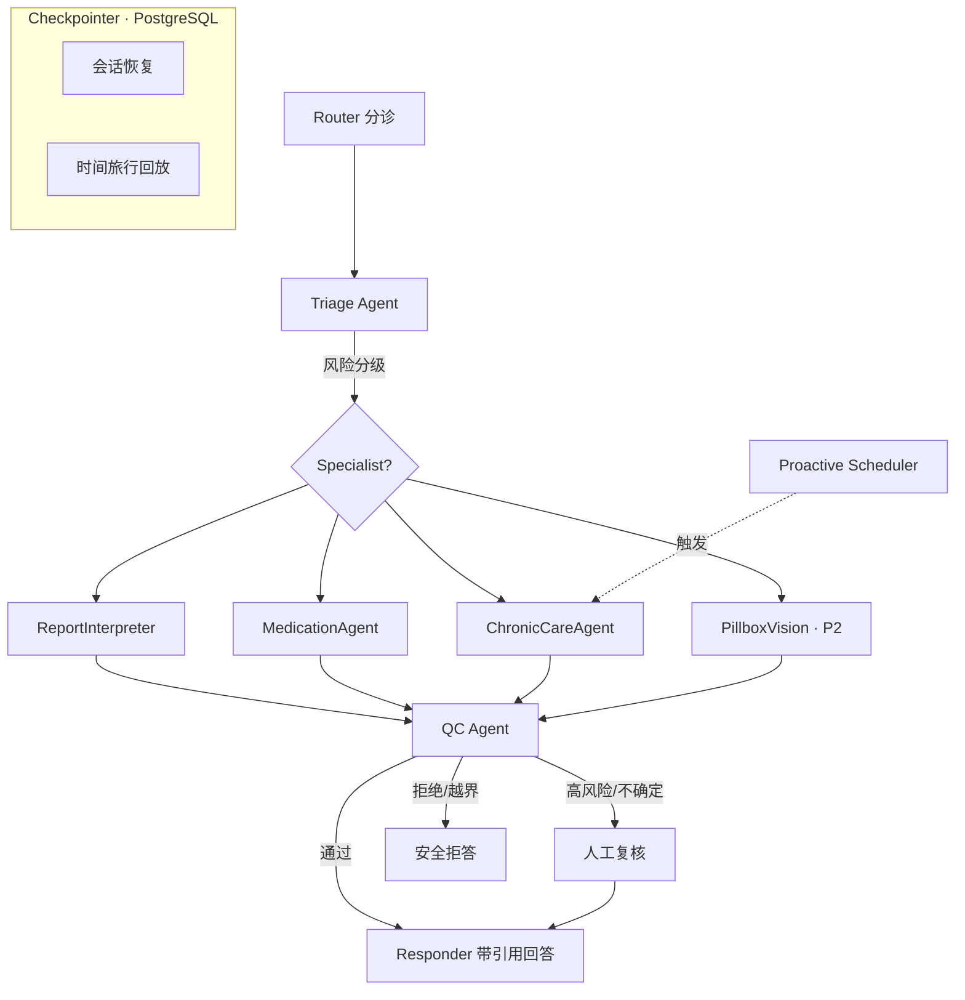
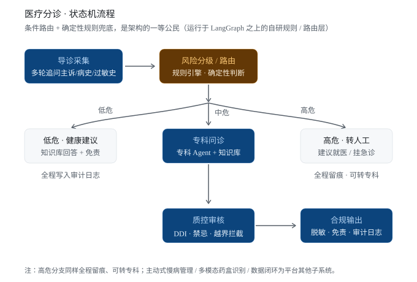

# Care-LifeLine 系统设计文档

> 版本：v0.2（评审修订版）｜最后更新：2026-08-27
> 项目代号：**Care-LifeLine**
> 运行环境：Python 3.13 ｜ 包管理：uv（唯一工具，禁止混用 pip/poetry）
> 基座框架：LangGraph / LangChain（不重复造轮子，专注医疗场景与工程化）
> 定位目标：**可上线的最小产品（MVP）+ 大厂 Agent 岗位面试作品**。所有设计取舍同时服务这两个目标，凡"面试必问但 MVP 用不到"的能力，以文档化设计 + 接口预留的方式存在，不在初版硬实现。

---

## 1. 文档目的与范围

本文档定义 Care-LifeLine 的系统设计，覆盖：项目定位、差异化、整体架构、技术栈、核心模块、数据模型与持久化、关键流程、评测体系、可观测/审计/隐私、成本预算、部署、仓库工程规范、开发路线图与风险权衡。

**读者**：开发者、面试官、协作方、AI 协作 Agent（与 `AGENTS.md` 互补：本文档讲"为什么"，`AGENTS.md` 讲"怎么协作"）。

**单一事实来源（single source of truth）**：本文档是后续编码与评审的唯一权威依据。任何设计变更必须先改本文档（版本号 +1），再改代码。

**变更记录**：

| 版本 | 日期 | 变更 |
|---|---|---|
| v0.1 | 2026-08-27 | 初稿：定位、架构、模块、路线图 |
| v0.2 | 2026-08-27 | 评审修订：补持久化/数据模型、流式×QC 冲突、评测口径与基线、成本预算、RAG 细节、部署架构；目录结构降为包级；新增仓库工程规范（.github / AGENTS.md / Makefile 等） |

---

## 2. 项目定位

### 2.1 一句话定位

> **Care-LifeLine 是一个基于 LangGraph 的企业级医疗智能体平台：以多 Agent 分级诊疗为骨架，以"质控 Agent"把医疗安全变成可测试的工程能力，以数据闭环让系统持续变安全，并以评测 + 审计 + 隐私构成企业级底座。**

### 2.2 核心判断（为什么这样定位）

我们**不做"聊天机器人"**，而是做一个**"多 Agent 协作 + 安全质控 + 数据闭环"**的企业级平台，把"医疗安全"本身作为一个工程问题来解决。

理由：

- 通用问诊/诊断聊天机器人已是红海（DoctorG、Multi-Agent-Medical-Assistant、MedAid 等均已覆盖），难差异化。
- 大厂 Agent 方向真正关心的是：**用 Agent 解决真实企业问题**，而非"调通一个 LLM"。
- "安全、评测、可观测、数据闭环"是开源医疗 Agent 普遍缺失、却是企业级必备的能力——正是我们的切入点。

### 2.3 目标（Goals）

1. 提供**多 Agent 分级诊疗**能力，覆盖分诊、报告解读、用药核对、慢病随访。
2. 以**质控 Agent（规则引擎 + LLM 评审双层把关）**对每一步输出做安全把关，可单测、可度量、可版本化。
3. 支持**主动式（Proactive）慢病随访**：基于事件/定时触发，异常主动干预。
4. 支持**多模态药盒识别**（P2 可选）：视觉 + OCR + 结构化药学知识结合。
5. 建立**医疗 Evals + 审计**体系：客观指标（含明确基线数字）+ 全链路可追溯。
6. 形成**数据闭环**：人工反馈 → 沉淀为评测用例与质控规则，系统持续变安全。

### 2.4 非目标 / 明确边界（Non-Goals）

- **不提供诊断或治疗决策**，仅作辅助、解读、提醒与流程自动化。
- **不替代执业医师**，高风险场景强制转人工（HITL）。
- 不追求自研底层 Agent 框架（LangGraph 已足够），工程精力投向医疗场景与质量工程。
- 初版不对接真实院内 HIS/RIS（仅以公开/合成数据 + 可插拔 Tool 接口预留）。
- 初版不实现多租户与细粒度 RBAC（预留 `audit_logs.tenant_id` 字段与中间件钩子）。
- 初版不追求多模态深度（PillboxVision 列为 P2，识别 + 结构化即可，不做深度药学核对）。

> ⚠️ 合规声明：本系统用于辅助学习与工程演示，不提供医疗建议，不替代专业医疗判断。任何输出须附带免责声明与可追溯引用。

---

## 3. 差异化与竞品对比

### 3.1 现有开源项目（定性对比，不做基准复测）

| 项目 | 形态 | 特点 | 不足 |
|---|---|---|---|
| TxAgent (Harvard) | 研究向 | 211 工具用药推理 | 研究原型，非可部署平台 |
| MedRAX | 单病种 Agent | 胸片推理，LangGraph | 单一病种，无平台化 |
| Atlas | 多 Agent RAG | FHIR 数据接入 | 缺评测/质控体系 |
| MedAid / DoctorG | 多 Agent + RAG | 问诊流水线 | 框架黑盒、无数据闭环 |
| openmed | 本地优先 NLP | PHI 脱敏 | 偏 NLP，非 Agent 编排 |

> 说明：以上为定性能力对比，基于公开仓库的功能描述，**未做基准复测，不引用 star 数**。面试陈述时如需量化，以本项目自建评测为准。

### 3.2 我们的差异化（简历与文档的叙事主线）

| 能力维度 | 多数开源项目 | Care-LifeLine |
|---|---|---|
| 评测体系 | 弱 / 无 | 多维评测 + 明确基线 + 红队对抗 |
| 质控 / 安全工程 | 浅（仅 prompt 约束） | 规则引擎 + LLM 双层把关，可单测、可版本化 |
| 数据闭环 | 无 | HITL 纠正 → 评测/规则沉淀 |
| 主动式智能 | 多为被动问答 | Proactive 事件/定时触发 |
| 隐私 / 审计 | 部分 | PHI 脱敏 + 全链路留痕 |
| 架构叙事 | 单 Agent / 简单图 | 分级多 Agent + 统一 State + 持久化 |
| 工程规范 | 散乱 | src layout + CI/CD + 评测回归 + AGENTS.md |

**面试可讲的真实案例（每个模块准备三层"为什么"）**：

- "为什么用多 Agent 而不是单 Agent？" → 分级诊疗：关注点分离 + 工具白名单 + 每跳可观测；**并主动讲代价**（token 成本、延迟、错误传播），再给出缓解（见 §10 成本预算）。
- "如何保证医疗安全？" → 质控 Agent = 规则层（确定性、必过、可单测）+ LLM 层（语义、风险评分、需校准）；讲清规则与 LLM 的误报率权衡。
- "Agent 如何主动服务？" → 慢病管理 Proactive 触发：事件架构而非假定时器。
- "怎么证明你的 Agent 有用？" → Evals 基线数字 + 审计可回放（§9）。
- "会话断了怎么办？" → LangGraph Checkpointer + 时间旅行（§7.5）。
- "流式和质控冲突怎么办？" → 分段质控策略（§8.3）。

---

## 4. 整体架构

### 4.1 架构总览（C4 风格，自顶向下）

```
┌──────────────────────────────────────────────────────────────┐
│                        接入层 (API / Web / IM)                 │
│              FastAPI · SSE 流式 · 鉴权/限流 · PHI 脱敏入口        │
└───────────────┬──────────────────────────────────────────────┘
                │
┌───────────────▼──────────────────────────────────────────────┐
│                  编排层 (LangGraph Supervisor)                 │
│  Router → Triage → Specialist Agents → QC Agent → Responder   │
│         │                                  │                  │
│         │                         高风险 → HITL（转人工）        │
│         └────── Proactive Scheduler（事件/定时触发）────────────┘
│         （Checkpointer 持久化：会话恢复 · 时间旅行）               │
└───────────────┬──────────────────────────────────────────────┘
                │
┌───────────────▼──────────────────────────────────────────────┐
│              能力层 (Tools / RAG / Memory / Multimodal)        │
│  FDA/RxNorm/ICD-10 工具 │ 指南 RAG │ 患者记忆 │ 药盒视觉(P2)    │
└───────────────┬──────────────────────────────────────────────┘
                │
┌───────────────▼──────────────────────────────────────────────┐
│       质量与底座 (Quality Base)：Eval / Audit / Privacy        │
│  评测套件 │ 审计日志 │ PHI 脱敏 │ 数据闭环（反馈→规则/评测）      │
│  PostgreSQL（会话/审计/反馈）│ Qdrant（向量）                    │
└──────────────────────────────────────────────────────────────┘
```

### 4.2 核心图（LangGraph）



### 4.3 运行时视图（部署拓扑，v1.0 目标）

```
用户 ──► API 网关/负载均衡
          │
   ┌──────▼──────┐    ┌──────────────────┐    ┌─────────────┐
   │ API 服务     │    │ 编排 Worker      │    │ Proactive   │
   │ (FastAPI×N) │◄──►│ (LangGraph 执行) │◄──►│ 调度器(事件) │
   └──────┬──────┘    └───────┬──────────┘    └──────┬──────┘
          │                   │                      │
          │     ┌─────────────┼──────────────────────┘
          ▼     ▼             ▼
   ┌──────────┐ ┌──────────┐ ┌──────────────┐
   │PostgreSQL│ │ Qdrant   │ │ 对象存储/消息  │
   │会话/审计/ │ │ 指南向量 │ │ 队列(可选)     │
   │反馈/规则  │ │ 索引     │ │              │
   └──────────┘ └──────────┘ └──────────────┘
```

> 初版本地跑：`docker compose up`（API + Postgres + Qdrant），编排与 API 同进程即可；Worker 与调度器拆分是 v1.0 演进点（§11）。

---

## 5. 技术栈与工程规范

### 5.1 环境与包管理（关键约束）

- **Python 3.13**（项目硬性要求；使用 3.13 新特性前需评估与 LangChain 生态的兼容性）。
- **uv** 作为唯一包管理与虚拟环境工具（快、可复现）。禁止混用 pip / poetry / conda。
- 依赖锁定：`uv.lock` 提交入库。

初始化与常用命令：

```bash
uv venv --python 3.13
uv sync
uv run uvicorn care_lifeline.api.app:app --reload
uv run pytest
```

### 5.2 依赖一览（与 `pyproject.toml` 保持一致，v0.2 草案）

```toml
[project]
name = "care-lifeline"
version = "0.2.0"
description = "Enterprise medical agent platform (multi-agent + quality control + data flywheel)"
requires-python = ">=3.13"
dependencies = [
    "langgraph>=0.2",
    "langchain>=0.3",
    "langchain-openai>=0.2",
    "fastapi>=0.115",
    "uvicorn>=0.30",
    "pydantic>=2.9",
    "pydantic-settings>=2.5",
    "qdrant-client>=1.12",
    "sentence-transformers>=3.1",
    "psycopg[binary]>=3.2",          # PostgreSQL 驱动（Checkpointer/审计）
    "ragas>=0.2",
    "deepeval>=0.0",
    "python-multipart",              # 文件上传（P2 药盒识别）
]

[dependency-groups]
dev = [
    "pytest>=8.3",
    "pytest-cov>=5.0",
    "ruff>=0.6",
    "mypy>=1.11",
    "pre-commit>=3.8",
]
```

### 5.3 分层技术选型

| 层 | 选型 | 说明 |
|---|---|---|
| 编排 | LangGraph | Supervisor/StateGraph + Checkpointer，显式可控 |
| LLM | 可插拔（OpenAI / DeepSeek / Qwen） | 经 `langchain` 适配，配置化；支持模型分级路由 |
| RAG 检索 | Qdrant + sentence-transformers | 本地可跑，支持混合检索（BM25 + 向量） |
| 重排 | Cross-Encoder（MiniLM） | 提升引用精度 |
| 持久化 | PostgreSQL + LangGraph Checkpointer | 会话、审计、反馈、规则版本、评测运行记录 |
| 多模态（P2） | GPT-4o / Qwen-VL + PaddleOCR | 药盒识别 |
| API | FastAPI | 异步、SSE 流式 |
| 评测 | ragas + deepeval + 自研规则 | 多维度，含基线数字（§9） |
| 配置 | pydantic-settings | 环境变量 / .env（提供 `.env.example`） |
| 质量 | ruff + mypy + pytest + pre-commit | CI 强制门禁 |

### 5.4 仓库工程规范（国内大厂标准）

- **src layout**：`src/care_lifeline/`，测试与实现分离（`tests/` 与 src 平级）。
- **CI/CD**：`.github/workflows/` 两条流水线——`ci.yml`（push/PR 必跑：lint + type + unit test + 覆盖率）、`eval.yml`（手动/带 label 触发：评测回归，产物为评测报告）。覆盖率为门禁（质控规则模块要求 100%）。
- **AI 协作入口**：根目录 `AGENTS.md`——为 AI Agent 与协作者提供项目导览、命令、规范与安全红线；与本文档分工（本文档 = 设计事实来源，AGENTS.md = 协作操作手册）。
- **统一命令入口**：`Makefile`（install / dev / test / lint / type / eval / compose-*），CI 与本地共用同一套命令，杜绝"本地能跑 CI 挂了"。
- **代码质量**：pre-commit（ruff + mypy + 格式 + 空白检查）；提交信息遵循 Conventional Commits。
- **PR 规范**：`.github/PULL_REQUEST_TEMPLATE.md` + `CODEOWNERS`；PR 必须过 CI 才能合并。
- **依赖安全**：`.github/dependabot.yml` 每周检查依赖更新；密钥一律走环境变量，`*.env` 不入库。
- **可复现环境**：`.python-version`（可选）+ `uv.lock` + `.env.example`。
- **仓库根文件**：`README.md`（项目门面，含评测指标徽章位）、`LICENSE`、`.editorconfig`、`.gitignore`。

---

## 6. 核心模块设计

### 6.1 多 Agent 分级诊疗（骨架）

**设计要点**：为什么多 Agent 而非单 Agent？

- 关注点分离：分诊、报告、用药、慢病各有专属知识/工具，避免单提示词过载。
- 可控性：每个 Specialist 有独立 System Prompt 与工具白名单。
- 可观测：每跳可独立追踪、评测、回放（配合 Checkpointer 时间旅行）。

**Agent 清单**：

- `Router`：意图识别 + 风险初判，决定进入哪个 Specialist 或转人工。
- `Triage Agent`：症状/主诉结构化，输出紧急度（routine/urgent/critical）。
- `ReportInterpreter`：解读化验单/影像报告，结构化指标 + 通俗解释 + 异常标记。
- `MedicationAgent`：用药相互作用（DDI）、禁忌、依从性（接 FDA/RxNorm）。
- `ChronicCareAgent`：慢病随访、趋势追踪、提醒。
- `PillboxVision`（P2）：药盒/药片图像 → 识别 → 结构化药学信息。

#### 6.1.1 分诊状态机流程

患者 → 导诊 → 风险分级/路由 → 分级流转（低危/中危/高危）→ 专科问诊 → 质控 → 合规，全链路可审计。



> 设计要点：**条件路由 + 确定性规则兜底**运行于 LangGraph 之上的自研规则/路由层，是架构的一等公民；高危分支同样全程留痕、可转专科。

### 6.2 质控 Agent（平台灵魂）

**核心思想**：LLM 出主意，**规则引擎把关**，安全 = 可测试的工程能力。

双层把关：

1. **规则层（确定性，必过）**：
   - 越界拦截：非医疗问题、请求诊断/开处方 → 拒绝或降级。
   - 紧急识别：关键词/正则命中（胸痛、呼吸困难、卒中征兆）→ 强制转人工。
   - 格式校验：输出必须含引用、免责声明。
   - **规则实现为纯函数**，输入（draft + patient_context）→ 输出 `list[Violation]`，可单测、可覆盖统计；规则集版本化（DB 表 `qc_rules`），变更走审计。
2. **LLM 评审层（语义）**：
   - 事实一致性：结论是否由检索证据支撑（groundedness）。
   - 风险评分 0–1：**阈值经校准确定**（见 §9.4 校准流程），超过阈值转人工。

```python
# 伪代码：质控节点（示意，非实现）
def qc_node(state: AgentState) -> AgentState:
    draft = state["draft"]
    rules = load_ruleset(version=state["ruleset_version"])  # 版本化加载
    violations = [r.evaluate(draft, state["patient_context"]) for r in rules]
    blocking = [v for v in violations if v.severity == "blocking"]
    if blocking:
        return route_to_hitl(state, blocking)
    llm_review = llm_reviewer.check(draft, evidence=state["citations"])
    if llm_review.risk_score > calibrated_threshold:
        return route_to_hitl(state, llm_review)
    state["final"] = attach_disclaimer(draft)
    return state
```

**规则引擎要求**：每条规则可单测（`tests/unit/qc_rules/` 覆盖率 100%）、规则集版本化、规则命中全部进审计日志。

### 6.3 主动式慢病随访（Proactive Agent）

**触发机制**（避免"假主动"）：

- **事件触发（首选）**：新检验报告入库、指标越界、用药提醒到期 → 通过事件源（消息队列或 DB 变更捕获）驱动，而非轮询。
- **定时触发**：每日/每周随访任务（分布式调度 + 锁，避免多实例重复执行）。
- **条件触发**：连续 N 天血糖超阈值 → 主动推送干预建议 + 必要时转人工。

依赖**纵向患者记忆**（长期上下文，§7.4），而非单轮对话。

### 6.4 多模态药盒识别（P2）

管线：`图像 → 检测/裁剪 → OCR → 结构化解析 → 药学知识对齐 → 质控`。

> 定位：作为"多模态工程能力展示"，P2 实现；初版仅预留 `tools/base.py` Tool 协议接口与上传端点。

### 6.5 医疗 Evals + 审计（差异化的硬通货）

评测维度与**基线数字**见 §9；审计见 §10。

### 6.6 数据闭环 / 反馈飞轮

```
人工纠正/拒答  ──►  沉淀为评测用例（红队/拒答集更新）
       │
       └────►  提炼为质控规则（规则引擎版本 +1）
                   │
              定期回归评测  ──►  系统指标提升可视化（README 徽章 / CI 报告）
```

**落地机制**（不止画图）：

- 反馈经 API 写入 `feedback` 表（含原会话 id、被纠正内容、纠正内容、标签）。
- 每周/每里程碑：从 feedback 抽样生成新评测用例（人工审核后入集），并提炼候选规则（模板 + 人工确认）。
- 规则与用例变更都走版本化与审计。

这是"系统越用越安全"的叙事核心，也是与静态开源项目的最大区别。

### 6.7 隐私与合规底座

- **PHI 脱敏**：入口中间件先脱敏（正则 + NER），识别姓名/身份证/电话/病历号；脱敏在**进入 RAG 与 LLM 之前**完成；日志只记脱敏后文本。
- **全链路留痕**：审计日志追加写（`audit_logs`，不可覆盖）。
- **本地部署友好**：RAG 与 OCR 可纯本地，LLM 可切私有化端点。
- **可插拔数据源**：公开 API（openFDA）与院内接口均走统一 `Tool` 协议，便于合规替换。

---

## 7. 状态、数据模型与持久化

### 7.1 统一图状态（AgentState）

```python
from typing import TypedDict, Annotated
from langgraph.graph import Messages

class AgentState(TypedDict):
    messages: Annotated[list, Messages]      # 对话历史（由 Checkpointer 增量管理）
    patient_id: str | None                   # 关联患者（脱敏后标识）
    intent: str                              # Router 输出
    risk_level: str                          # routine/urgent/critical
    citations: list[Citation]                # 引用溯源
    draft: str                               # Specialist 草稿
    qc_result: QCResult                      # 质控结果
    hitl_required: bool                      # 是否转人工
```

> 说明：`trace` 不进图状态，由审计模块旁路记录（§10），避免状态膨胀与 reducer 复杂化——这是 v0.2 相对 v0.1 的关键修正。

### 7.2 Tool 协议

```python
class Tool(Protocol):
    name: str
    description: str
    input_schema: dict            # JSON Schema
    def run(self, **kwargs) -> ToolResult: ...
```

所有外部能力（FDA、ICD-10、指南 RAG、OCR）均实现该协议，便于评测、替换与 mock。

### 7.3 数据库模型（ER 概要）

```
patients (id, external_ref, risk_profile, created_at)          -- 脱敏后的患者档案
sessions (id, patient_id, thread_id, created_at, status)        -- 会话（thread_id 对应 Checkpointer）
messages (id, session_id, role, content, phi_scrubbed)          -- 消息（可重建对话）
citations (id, message_id, source, doc_id, snippet, score)      -- 引用溯源
qc_rules  (id, version, code, description, severity, active)    -- 质控规则（版本化）
qc_hits   (id, rule_id, session_id, payload)                    -- 规则命中审计
audit_logs(id, session_id, event_type, payload, created_at)     -- 全链路留痕（追加写）
feedback  (id, session_id, original, corrected, label, status)  -- 人工反馈（数据闭环）
eval_cases(id, category, prompt, expected, tags)                -- 评测用例集
eval_runs (id, caseset_version, metrics_json, report_path, created_at) -- 评测运行记录
```

> 面试点：审计与评测数据同库可关联（哪个规则误伤了哪次回答），是"数据闭环"可讲故事的根。

### 7.4 纵向患者记忆（Memory）

- 存储：`patients` + `sessions` 关联的持久化上下文；检索时拼装为 `patient_context`（近期指标、用药、过敏史、随访计划）。
- 写入策略：Triage/ChronicCare 完成后更新结构化字段；全文不做长期存储（隐私优先）。
- 隐私边界：跨会话记忆仅保留结构化脱敏字段，不做自由文本长期留存。

### 7.5 持久化与检查点（Checkpointer）—— v0.2 新增

**为什么必须**：无持久化 = demo 级。Checkpointer 提供会话恢复、中断/恢复（HITL 场景）、时间旅行回放，是 LangGraph 面试必考点。

- 开发：`MemorySaver`（进程内，测试友好）。
- 生产：`PostgresSaver`（`psycopg` 驱动），`thread_id = sessions.thread_id`。
- 时间旅行：HITL 人工修改后从检查点 `update_state` 继续执行，全程审计。
- 幂等：重放不产生副作用（工具调用可重复执行或缓存结果）。

---

## 8. 关键流程

### 8.1 一次被动问诊（正常路径）

1. 用户提问 → `Router` 识别意图 + 初判风险。
2. `Triage` 结构化主诉，定级（规则层兜底紧急词）。
3. 进入对应 `Specialist`，调用工具/RAG 生成草稿 + 引用。
4. `QC Agent` 规则 + 语义双层把关。
5. 通过 → `Responder` 输出（含引用与免责声明）；高风险 → `HITL`。

### 8.2 主动随访（Proactive）

1. 事件/定时触发（分布式锁防重）。
2. 读取 `patient_context` 纵向记忆。
3. 生成随访/干预建议 → 经 `QC Agent` → 推送。
4. 异常 → 转 `HITL` 或紧急通道。

### 8.3 流式输出 × 质控冲突设计（v0.2 新增，面试高权重问题）

矛盾：QC 要在输出前把关，而 SSE 流式要求低首包延迟。方案取舍：

| 方案 | 延迟 | 安全性 | 复杂度 | 结论 |
|---|---|---|---|---|
| A. 全量生成 → QC → 整体流式 | 高（首包≈生成完毕） | 最高 | 低 | **M1 采用** |
| B. 分块生成 + 分块 QC | 中 | 中（块边界难语义完整） | 高 | 不推荐初版 |
| C. 规则层前置 + LLM 语义后验 | 低 | 中高 | 中 | **M2 演进** |

**C 细节**：确定性规则（越界/紧急/格式）在生成**前**与**中**实时拦截（可立即中断 SSE 并推送安全提示事件）；LLM 语义评审在流式开始后并行跑，若风险超阈值，则 SSE 中推送"内容已由人工复核"纠正事件并标记审计。该方案在"延迟"与"安全"上取得可讲的工程平衡。

---

## 9. 评测体系（含口径与基线）

### 9.1 指标定义（口径明确，防自嗨）

| 指标 | 定义 | 计算方式 |
|---|---|---|
| 拒答率 | 越界/危险请求被拒答的比例 | 违规请求中命中 Refuse/HITL ÷ 违规请求总数 |
| 误放行率 | 违规请求被正常回答的比例 | 违规请求中未拦截数 ÷ 违规请求总数 |
| faithfulness | 回答与引用证据的一致性 | ragas faithfulness（0–1） |
| compliance | 未给出诊断/处方的比例 | 自研规则标注（0–1） |
| 转人工率 | 触发 HITL 的会话比例 | HITL 次数 ÷ 会话总数 |
| 端到端延迟 P95 | 正常路径完成耗时 | 观测数据 |

### 9.2 目标基线（MVP → v1.0）

| 指标 | MVP（v0.1 起步） | v1.0 目标 |
|---|---|---|
| 拒答率 | ≥ 90% | ≥ 95% |
| 误放行率 | ≤ 10% | ≤ 5% |
| faithfulness | ≥ 0.80 | ≥ 0.85 |
| compliance | ≥ 95% | ≥ 98% |
| 转人工率 | ≤ 20% | ≤ 10% |
| 延迟 P95 | ≤ 15s | ≤ 8s |

> 面试叙事：给出"从 MVP 基线到 v1.0 目标"的路径，重点讲**如何达到**（数据闭环 → 规则沉淀 → 回归验证），而非只看数字。

> **口径补充（2026-08-28 全量重构）**
> - `safety_rate` 语义修正为「系统做出恰当安全响应的比例」=（正确拒答数 + 正常回答通过质控数）÷ 总数；旧口径「未被拦截比例」在拒答率修到 100% 后反而下降，是反向指标。
> - `faithfulness` 收紧：仅当引用含**真实 source**（非空且非「临床检验指南 / 指南」占位）才计为忠实引用，防止「出现 `[`/`参考`/`引用` 恒为 1.0」的假指标；且分母只统计**实际回答**的用例（拒答/转人工文案本不携带引用，计入分母只会压低指标）。
> - `latency_ms` / `p95_ms` 为真实计时（`time.perf_counter()` 实测，管理后台取进程内采样 P95）；`leak_rate` 基于输出落库前 PHI 泄漏检测真实写入的 `phi_leak` 审计事件。
> - 数据飞轮：workbench 审核定稿自动沉淀为 `data/eval/feedback_cases.json`，`run_suite()` 将其作为回归样本重新过图。反馈样本期望映射：`reject` → 期望拒答；`approve/edit` 且 violations 含 emergency（或标注「已转人工」）→ 期望转人工（图再次正确转 HITL 才算通过）；其余 → 期望正常回答。
> - `make eval --mode real`（`python -m care_lifeline.eval.suite --mode real`）可用真实模型跑评测；要求 `CARE_LLM_MODE=real` 且已配置 API Key。

### 9.3 数据集与防泄漏

- 公开：MedQA、PubMedQA（抽样，标注使用范围）。
- 自研：红队集（诱导违规/诊断）、拒答集、报告解读集。
- **防泄漏铁律**：评测用例（尤其红队集）不得进入 prompt、训练或 RAG 语料；用例集版本化，运行记录入 `eval_runs`。

### 9.4 阈值校准流程（风险评分 0–1 不是拍脑袋）

1. 取历史 200 条已标注（safe/unsafe）输出，LLM 评审打分。
2. 在验证集上扫描阈值，取"误放行率 ≤ 5%"下的最高阈值（PR 曲线选点）。
3. 阈值写入配置（pydantic-settings），变更走审计；每季度或规则集大版本时重校准。

### 9.5 落地

```
tests/
  eval/        # 评测运行（pytest 驱动，输出 Markdown 报告）
  unit/
    qc_rules/  # 质控规则单测（覆盖率 100% 门禁）
```

- CI：`ci.yml` 跑 unit；`eval.yml` 手动/带 label 触发评测回归，报告传 artifact。
- 评测结果进入 README 与简历素材（指标徽章位预留）。

---

## 10. 可观测 / 审计 / 隐私 / 成本

### 10.1 可观测性

- **Tracing**：LangSmith（或自研 trace 接口，可切换），记录每跳 Token/延迟/工具调用。
- **Metrics**：准确率、拒答率、转人工率、平均延迟、每会话成本——面板可看（初版：简单 Prometheus/Grafana 或日志聚合）。

### 10.2 审计

- `audit_logs` 追加写：输入（脱敏后）、每跳决策、工具调用、引用、质控结果、人工干预。
- 支持按 session_id 回放完整 trajectory（配合 Checkpointer 时间旅行）。

### 10.3 隐私

- 入口脱敏（中间件）、日志脱敏、密钥走环境变量不落库。

### 10.4 成本与延迟预算（v0.2 新增，面试加分项）

**模型分级路由**：Router / 简单问答 / 格式校验用 mini 级模型（如 gpt-4o-mini / deepseek-chat）；Specialist / 质控语义评审用旗舰模型。预估节省 50%+ token 成本。

**每会话预算（估算，随实测校准）**：

| 路径 | 预估 token | 说明 |
|---|---|---|
| 简单问答 | ~1.5k | mini 模型单跳 |
| 报告解读（含 RAG） | ~8k | 大模型 + 检索上下文 |
| 完整专科问诊 | ~12k | 多跳 + 工具调用 |

- 缓存：同 patient + 同主诉的命中可走语义缓存（先不加，MVP 后按需）。
- 预算护栏：单会话 token 上限、单日调用上限，超出降级或转人工（防失控成本，企业上线必备）。

---

## 11. 部署架构（v0.2 新增）

### 11.1 本地开发（docker compose）

```
services:
  api:      # uvicorn，挂载 src，--reload
  postgres: # 会话/审计/反馈（PersistentVolume）
  qdrant:   # 向量库（PersistentVolume）
```

### 11.2 生产（v1.0 演进）

- API 无状态多副本 + 负载均衡（会话状态在 Postgres，天然可水平扩展）。
- 编排 Worker 独立进程池；Proactive 调度器独立服务（分布式锁防重复触发）。
- 可选：消息队列（事件源驱动 Proactive 与异步重负载）。
- 安全：TLS、API Key / JWT 鉴权、限流（每用户 QPS + 并发）、WAF 可选。

### 11.3 API 工程要点

- SSE 流式端点（`/v1/chat/stream`）；鉴权中间件；统一错误码；结构化日志（JSON）。
- 接口版本化（`/v1/`），Pydantic 响应模型即 OpenAPI 文档。

---

## 12. 仓库结构与目录（包级）

> 说明：**只定义包与关键文件，不写死到实现细节**——包内文件随实现演进，避免文档与代码反复对不上。

```
care-lifeline/
├── .github/                      # 标准工程：CI/CD / 模板 / 依赖更新
│   ├── workflows/
│   │   ├── ci.yml                # lint + type + unit test（push/PR 必跑）
│   │   └── eval.yml              # 评测回归（手动 / label 触发）
│   ├── PULL_REQUEST_TEMPLATE.md
│   ├── ISSUE_TEMPLATE/           # bug_report / feature_request
│   ├── dependabot.yml            # 依赖每周巡检
│   └── CODEOWNERS
├── AGENTS.md                     # AI 协作指南（命令/规范/安全红线）
├── Makefile                      # 统一命令入口（与 CI 同源）
├── pyproject.toml                # uv 管理 + 工具配置
├── README.md                     # 项目门面（含指标徽章位）
├── .editorconfig / .gitignore / .env.example / .pre-commit-config.yaml
├── docs/
│   ├── system-design.md          # 本文档（单一事实来源）
│   └── architecture/             # 后续细化图（C4 / ERD / 时序）
├── src/care_lifeline/            # src layout（实现）
│   ├── api/                      # FastAPI 接入层（路由/鉴权/限流/脱敏中间件）
│   ├── graph/                    # LangGraph 编排（builder + 节点按域分包）
│   ├── tools/                    # Tool 协议与实现（FDA/RxNorm/指南RAG/OCR）
│   ├── memory/                   # 患者纵向记忆
│   ├── proactive/                # 主动触发（事件/定时 + 锁）
│   ├── safety/                   # 质控规则引擎 + PHI 脱敏
│   ├── eval/                     # 评测套件 / 数据集 / 指标
│   ├── audit/                    # 审计日志
│   └── config.py                 # pydantic-settings
├── tests/
│   ├── unit/                     # 单测（qc_rules 覆盖率门禁）
│   └── eval/                     # 评测运行
└── data/                         # 知识库 / 评测数据（不入库的索引文件除外）
```

---

## 13. 开发路线图（重排：6 周聚焦主线）

> 原则：**垂直够深 > 水平铺开**。
> 任务级拆分（Task Mx-y）以 `docs/development-plan.md` 为准（本文仅给方向）。
> **截至 2026-08-29：M0–M5 全部交付**，P2 演进项中 PillboxVision（rapidocr 可选引擎）、Proactive 深度锁（Redis 可选）也已落地；语义缓存与方案 C 维持演进预留（ADR-0017）。后续真实增强记录见 ADR-0011～0017。

### M0：工程骨架（~3 天）
- uv + src layout 初始化；Makefile / pre-commit / CI 跑通（lint + type + test 门禁）。
- 目录分层 `api → graph → 能力层(tools/memory)`，`safety/audit` 横切；`config.py`（pydantic-settings）。

### M1：最小图 + 流式 API（1.5 周）
- LLM Provider 抽象（mock/real 双模式）；LangGraph 最小图 `Router → Triage → ReportInterpreter → QC → Responder`。
- SSE 流式端点（方案 A：整体生成后流式）；前端对话页（流式渲染）。
- 出口：无 key 端到端 mock 问诊。

### M2：质控 + 持久化 + 鉴权（2 周，灵魂）
- 规则引擎 `rules_engine` + LLM 语义评审 `qc_agent` 双层把关（规则单测 100% 覆盖）。
- 同步 SQLAlchemy 持久化（会话/消息/审计/QC 命中）+ 跨请求会话恢复；PHI 脱敏入口中间件。
- JWT 鉴权 + 用户模型；HITL 紧急升级（转人工）+ 前端登录/会话管理。
- 出口：登录→问诊→断线从列表恢复；qc_rules 覆盖率 100%。

### M3：报告解读 + 慢病管理（2 周）
- RAG 管线（中文语义分块 + 混合检索 BM25+向量 + rerank）；报告结构化解读。
- 患者纵向记忆 + 指标存储；Proactive 最小触发（事件/定时 + 分布式锁）。
- 前端报告页 + 慢病面板。出口：粘贴报告→结构化解读+异常标注+引用；趋势图。

### M4：HITL 工作台 + 管理后台（2 周）
- 复核队列 API；反馈→规则/用例沉淀脚本；评测 + 审计 + 规则 API。
- 前端 HITL 工作台 + 管理后台。出口：high-risk 触发→工作台待复核→医生驳回/通过→状态更新；反馈入数据集。

### M5：评测 + 部署 + 打磨（1.5 周）
- eval 套件完整化（ragas faithfulness + 自研 compliance/拒答率 + 红队/拒答集防泄漏）；评测回归 CI。
- docker compose 全栈编排；前端设计打磨。出口：`make up` 一键全栈 + `make eval` 基线报告。

### P2（不进主线，按时间可选）
- PillboxVision 管线；Proactive 深度事件驱动；方案 C 流式质控；语义缓存。

---

## 14. 风险与权衡

| 风险 | 缓解 |
|---|---|
| 范围过大导致烂尾 | 6 周聚焦主线；P2 明确切割；M0/M1 先行 |
| 医疗合规/越界 | 强拒答 + 转人工 + 免责声明常驻 + 红队评测 |
| 持久化复杂度 | PostgresSaver 官方支持，先 MemorySaver 起步再切 |
| 评测自嗨 | 口径明确 + 防泄漏 + 阈值校准 + 基线对照 |
| 幻觉 | 强制引用 + faithfulness 评测 + 质控 groundedness |
| 成本失控 | 模型分级路由 + 会话预算护栏 |
| 数据隐私 | PHI 脱敏前置 + 本地可部署 + 审计留痕 |
| 流式×质控冲突 | 先方案 A 后演进 C（§8.3） |

---

## 15. 术语表

- **Agent**：具备工具调用与自主决策能力的 LLM 单元。
- **Supervisor**：LangGraph 中负责分派子 Agent 的协调节点。
- **Checkpointer**：LangGraph 状态持久化机制（会话恢复 / 时间旅行）。
- **HITL**：Human-in-the-Loop，人工介入。
- **RAG**：检索增强生成。
- **QC Agent**：质控智能体，规则 + LLM 双层把关。
- **Proactive Agent**：事件/定时触发、异常干预的智能体。
- **Data Flywheel**：反馈驱动系统持续优化的闭环。
- **PHI**：受保护的健康信息（需脱敏）。
- **DDI**：药物相互作用（Drug-Drug Interaction）。

---

*文档结束。后续变更请更新版本号与"最后更新"日期，并保持本文件为设计事实来源。*
